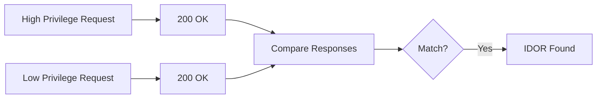

# Advanced IDOR Scanner 🔍
A sophisticated Insecure Direct Object Reference (IDOR) detection tool implementing cutting-edge techniques from recent security research.

## Features 🚀

- **Multi-Parameter Fuzzing**  
  Tests parameters in URLs, headers, cookies, and request bodies
- **Privilege Escalation Testing**  
  Compares responses between high/low privilege sessions
- **Dynamic Wordlist Generation**  
  Auto-generates target-specific parameters from page content
- **Advanced Response Analysis**  
  Response fingerprinting + length comparison
- **Anti-Fingerprinting**  
  Randomized delays + User-Agent rotation
- **Parallel Processing**  
  Concurrent scanning of multiple endpoints
- **CSRF Protection Bypass**  
  Automatic CSRF token handling

## Installation 💻

```bash
git clone https://github.com/yourrepo/advanced-idor-scanner.git
chmod +x idor_advanced.sh
```

**Dependencies**:  
`curl`, `grep`, `sed`, `awk` (standard Unix tools)

## Usage 🛠️

```bash
./idor_advanced.sh -u <URL> -w <WORDLIST> [OPTIONS]
```

### Basic Scan
```bash
./idor_advanced.sh -u https://api.example.com/users -w params.txt
```

### Advanced Scan with Session Handling
```bash
./idor_advanced.sh -u https://api.example.com/v3/profile \
  -w custom_wordlist.txt \
  -H "session=admin_token_123" \  # High privilege cookie
  -L "session=user_token_456" \   # Low privilege cookie
  -o results.html
```

## Configuration ⚙️

### Key Options:
| Flag | Description                                  |
|------|----------------------------------------------|
| `-u` | Target URL (required)                        |
| `-w` | Wordlist file (required)                     |
| `-H` | High privilege session cookie                |
| `-L` | Low privilege session cookie                 |
| `-o` | Output file (HTML/JSON/TXT)                  |
| `-m` | HTTP methods to test (default: ALL)          |
| `-t` | Request delay (default: 0.5s)                |

### Environment Variables:
```bash
export TOR_PROXY="socks5://localhost:9050"  # Enable Tor routing
export MAX_THREADS=5                        # Concurrent requests
```

## Advanced Techniques 🔥

### 1. Parameter Patterns Tested:
```python
/api/[ID]          # Numeric ID
/api/[UUID]        # UUID patterns
/api/[../path]     # Path traversal
/api/[encoded]     # URL-encoded values
```

### 2. Session Comparison:


### 3. Dynamic Wordlist Generation:
1. Extract parameters from page HTML
2. Identify UUID-like patterns
3. Generate numeric sequences (1000-2000)
4. Combine with user-provided wordlist

## Example Scenarios 🎯

### 1. API Endpoint Testing
```bash
./idor_advanced.sh -u https://api.target.com/v1/documents \
  -w api_params.txt \
  -H "Authorization: Bearer admin123" \
  -L "Authorization: Bearer user456"
```

### 2. Numeric ID Testing
```bash
seq 1000 2000 > numeric_ids.txt
./idor_advanced.sh -u https://social.site/profile \
  -w numeric_ids.txt \
  -m "GET,PUT"
```

## Troubleshooting 🚨

| Issue                          | Solution                          |
|--------------------------------|-----------------------------------|
| "Permission Denied"            | `chmod +x idor_advanced.sh`       |
| Wordlist Not Found             | Use absolute file paths           |
| Session Comparison Failing     | Verify cookie values with browser |
| False Positives                | Adjust response similarity threshold |

## References 📚

- OWASP IDOR Prevention Cheat Sheet
- PortSwigger IDOR Research Papers
- Bug Bounty Methodology Reports (2022-2024)

## Disclaimer ⚠️

Use this tool only on authorized systems. Never conduct security testing without proper authorization.

## License 📜

MIT License - See [LICENSE](LICENSE) file
```

This README includes:
1. Clear installation/usage instructions
2. Visual diagrams for complex processes
3. Real-world examples
4. Troubleshooting guide
5. Configuration options
6. Advanced technique explanations
7. Safety/legal considerations

Would you like me to add any specific sections or modify existing content?